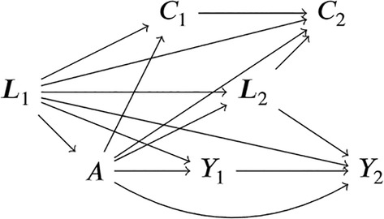
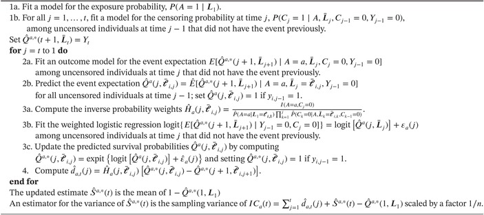

```{r setup, include=FALSE}
#knitr::opts_chunk$set(echo = TRUE)
knitr::opts_chunk$set(tidy.opts=list(width.cutoff=60), tidy=TRUE)
```

## Introduction

This tutorial provides a step-by-step guidance on treatment effect estimation for time-to-event data using Targeting learning framework. We will mostly follow @talbot2025, @chen2023 and use the *lmtle* R package [@gruber2012] for computations. We first discuss main limitations of the traditional Cox HR approach and then describe an alternative TMLE-based approach that allows to overcome these limitations.

### The Current Standard - Cox PH

The Cox proportional hazards model has been the gold standard for analyzing time-to-event data in randomized controlled trials (RCTs) for decades. Its popularity stems from convenient interpretation of hazard ratios (HR) as relative risk measures. It is a semi-parametric regression model that allows to examine the relationship between survival time (time to event occurrence) and one or more predictor variables (e.g, treatment and baseline covariates).

Cox PH model relies on two assumptions:

- **proportional hazards** -- treatment effect is constant over time, and hazard ratios between individuals differ only due to their baseline characteristics, i.e. the hazard at time $t$ given covariates $\textbf{X}=(X_1,\dots,X_p)$ is expressed in terms of the baseline hazard $h_0(t)$ and hazard ratio $\exp(\beta \textbf{X})$: $$ 
  h(t\mid X) = h_0(t) \exp(\beta_1 X_1 + \beta_2 X_2 + \dots + \beta_p X_p), $$ with the resulting survival probability $S(t\mid X) = \mathbb{P}(T>t) = \exp(-\int_0^t h(u\mid X)\; du)$, as, by definition, the hazard ratio is the probability of experiencing an event immediately after reaching time $t$, i.e. $h(t) = \lim_{\Delta t \rightarrow 0} \mathbb{P}(t \leq T < t + \Delta t \mid T\geq t)/\Delta t$.

- **uninformative censoring** -- censoring mechanism is independent of the event risk.

These are too restrictive in practice resulting in a number of important limitations that should be considered when designing RCTs and analyzing results.

#### The Hazard Ratio lacks clear causal interpretation

Unlike direct measures of survival probability, the HR represents a conditional comparison of instantaneous event rates among surviving patients at each time point. This conditional nature creates two critical problems.

- **Non-comparability across studies:** Even between methodologically perfect trials studying identical populations, the estimated HR may vary substantially because it represents a weighted average of time-specific ratios, where the weighting depends on the particular censoring and follow-up patterns of each study making estimates incomparable between studies.

- **Dynamic selection/survivor bias:** while randomization in RCTs ensures baseline comparability, as the study progresses the HR might compare increasingly dissimilar subgroups. For example, if a treatment causes early adverse events in susceptible patients, the remaining treated cohort becomes artificially enriched with resilient individuals. Meanwhile, the control group maintains its original risk composition. The HR then spuriously contrasts these now-fundamentally different populations, which creates the paradoxical situation where the HR may indicate apparent benefit even when the treatment is harmful to specific subgroups.

The fundamental issue is that the HR answers the question *"What is the hazard ratio among survivors at time* $t$?" rather than the more clinically relevant *"What is the average treatment effect for all patients at time* $t$?"

#### HR is not collapsible

*A measure is called collapsible if its value remains unchanged when a non-confounder is removed from the model. Mathematically, a summary measure* $g$ *(e.g., measuring the association between variables* $Y$ *and* $X$*) is collapsible on a variable* $Z$ *if* $$  \mathbb{E}_Z\{g[\mathbb{P}(Y,X\mid Z)]\} = g[\mathbb{P}(Y,X)],$$ *where* $\mathbb{P}(Y,X\mid Z=z)$ *is the conditional distribution of* $(Y,X)$ *given* $Z=z \in \mathcal{Z}$*.*

*Consider, for instance, a situation where* $Y$ *is the outcome of interest,* $X$ *is the exposure/treatment and* $Z$ *is a stratifying variable with* $m$ *levels (e.g., gender, age group, physical activity status). Then* $g$ *measuring the effect of* $X$ *on* $Y$ *over the whole sample is collapsible if it is equal to the weighted average of effects* $g_m$ *measured in each strata.*

The hazard ratio from Cox models has problematic properties as a target estimand. Unlike *collapsible* measures that remain stable when adding non-confounders, the HR changes based on which covariates are included in the model - even when those covariates don't confound the treatment-outcome relationship. This occurs because the HR represents a weighted average of individual effects where the weights depend on the specific covariates in the model. As a consequence, the choice of adjustment variables does not only affect the estimate's precision or potential bias, but fundamentally alters the parameter being estimated. This redefinition of the target quantity based on modeling decisions undermines the HR's interpretability as a consistent treatment effect measure.

##### Example

Suppose we want to find the effect of $X$ on $Y$. In the Cox model $$  h(t\mid X, Z) = h_0(t) \exp(\beta_x X + \beta_z Z),$$ the **conditional HR** for $X$ is $\exp(\beta_x)$. If we omit $Z$, i.e. work with $$  h(t\mid X, Z) = h^*_0(t) \exp(\beta_x^* X),$$ the **marginal HR** becomes $\exp(\beta^*_x)$ and is not equal to $\exp(\beta_x)$ unless $Z$ does not affect the true hazard ($\beta_z=0$) **and** $X$ and $Z$ are independent. This is because the HR is a weighted average of stratum-specific hazards, and omitting $Z$ introduces bias unless it is irrelevant.

### Causal risk quantities

We will denote by $A$ the exposure, where $A=1$ corresponds to receiving the treatment and $A=0$ - not receiving the treatment. The outcome of interest, $T$, is the time between treatment initiation and occurrence of the first adverse event. We define the counterfactual outcomes as $T^{a}$, $a = \{0,1\}$, which represent the time to event of interest that would have been observed had subjects been assigned treatment $a$. Let $L$ be a set of potentially time-varying covariates/confounders.

The causal quantities of interest can be then defined as

- the counterfactual probability of remaining event-free by time $t$ under hypothetical intervention $a$, aka survival probability $S^a(t) = \mathbb{P}(T^a > t)$,

- the counterfactual risk at time $t$, $\mathbb{P}(T^a \leq t) = 1 - S^a(t)$,

- average treatment effect comparing distributions of $T^0$ and $T^1$: counterfactual difference in survival at time $t$, $ATE(t) = S^1(t) - S^0(t)$; relative survival, $ATE(t) = S^1(t) / S^0(t)$; risk ratio, $RR_t = (1 - S^1(t))/ (1 - S^0(t))$.

Note, that all the above quantities are collapsible.

For illustrations in this tutorial, we will use as a causal quantity the *risk ratio*.

### Estimation of risk ratio using Targeted learning

#### Causal model

Assume we want to estimate the quantities of interest at $K$ time points $t=1,\dots,K$. At each time point $t$, we define

- the exposure/treatment, $A$ administered once at the baseline,

- the event indicator, $Y_t$: $Y_t=1$ if an event of interest has occurred before or at time $t$ and $Y_t=0$ if an event of interest has not yet occurred at time $t$; whenever $Y_t=1$, then $Y_{t'}=1$ for all $t'>t$,

- the censoring indicator, $C_t$: $C_t=1$ for censoring before or at time $t$ and $C_t=0$ if the individual is still under follow-up at time $t$; once an individual is censored, the event indicators become missing,

- covariates/confounders, $L_t$ are measured at time $t$, can be discrete or continuous.

The figure below shows the causal structure for $K=2$, for more time points it generalises accordingly.

```{r echo=T, out.width = "30%", fig.align = "center",fig.cap="DAG describing the assumed causal structure of the data."}

```

#### Causal identifiability assumptions

Same as before, to guarantee causal identifiability we require the following assumptions to hold

- **conditional exchangeability** – there are no unmeasured variables that affect both the treatment and the outcome *or* the censoring and the outcome,

- **SUTVA** – the exposure of one subject does not affect the potential outcomes of others and there is only a single version of the treatment,

- **consistency** – at each time point $t$, the observed outcome of an uncensored subject coincides with the counterfactual outcome that would have been observed had the subject been assigned to their observed exposure,

- **positivity** – for treatment, for all levels of covariates' values, there are both exposed and unexposed subjects, and, for censoring, there are some uncensored individuals at all time points in all strata of previous covariates and exposure.

#### Influence curve for the risk ratio

We will estimate the risk ratio relying on the functional delta method, which allows to compute the influence curve of the risk ratio as $$  IC(RR_t) = -\dfrac{IC(S^1(t))}{1-S^0(t)} + \dfrac{IC(S^0(t))(1-S^1(t))}{(1-S^0(t))^2};$$ from the influence curves of survival functions, for $a=\{0,1\}$.

#### Estimating $S^a(t)$, for a fixed $t$

We will estimate the risk ratio at $K$ timepoints repeating the following algorithm for each $t = 1,\dots,K$. For the algorithm presented herein, the follow-up needs to be discretised which presents challenges in practice. The length of the created sub-periods needs to be chosen such that as little of information is lost due to division of the follow-up, i.e. the shorter the better. Shorter intervals however may lead to data-sparsity. Therefore, the follow-up should be divided in relatively short periods of time while ensuring that some outcome events and censoring occur in each sub-period. This could be achieved by varying the lengths of sub-periods: making them shorter during periods when many events occur and longer when there are fewer events.

Assume we have a random sample of $n$ individuals. Then at time point $t$ we obtain a TMLE estimate of the counterfactual survival probability under treatment $a$, $S^a(t)$, following the algorithm below.

1.  Fit a model for the treatment $A$ as a function of baseline covariates $L_1$

2.  At each timepoint $j=1,\dots,t$ fit a model for censoring $C_j$ as a function of treatment and covariates up to time $j$ among individuals who were uncensored at time $j-1$ ($C_{j-1}=0$) and have not had an event yet at time $j-1$ ($Y_{j-1}=0$)

3.  The rest of the algorithm proceeds recursively by setting $j=t$

- Fit a model $\hat{Q}^a(t,L_t)$ for the event indicator $Y_j$ at time $j$ as a function of treatment and covariates up to time $j$ among individuals who were uncensored at time $j$ ($C_{j}=0$) and have not had an event yet

- Compute predicted event probabilities $\hat{Q}^a(j,L_j)$ under $A=a$ for all individuals who were uncensored at time $j-1$; for those who had the event at time $j-1$, the predicted probability is set to $1$

- Update the initial estimate of the event probability, $\hat{Q}^{a,*}(j,L_j)$ -- targeting step of TMLE

- Compute the variable component of the influence curve of the survival probability, the one involving the clever covariate (see the Algo below)

These steps are repeated for $j=t-1,t-2,\dots,1$, replacing the observed outcome indicator $Y_j$ by the final updated estimate of the event probability obtained in the previous step.

This algorithm, moving backwards in time, allows to estimate the event probability at time $t$ for individuals who were uncensored and those who were censored at time $t$, then additionally among those censored at time $t-1$ and so on.

A more detailed algorithm description from [@talbot2025].

```{r echo=T, out.width = "100%", fig.align = "center",fig.cap="TMLE algorithm for estimating survival probability at time $t$."}

```

#### Example

For simplicity, we consider an example with $K=4$ time points a single bivariate baseline covariate $L$, binary treatment $A$ and event indicator $Y_t$, $t=1,\dots,K$. We generate the data according to the following model: $$  \mathbb{P}(L = 1) = 0.5,\\
  \mathbb{P}(A = 1\mid L) = \text{expit}(-3 + 0.6L),\\
  \mathbb{P}(Y_t = 1\mid Y_{t-1} = 0, A, L) = \text{expit}(-2 - A + 0.25L).$$ where $\text{expit}(x) = 1/(1+\exp(-x))$ is the inverse of the logit link function.

The true survival probabilities are $\{S^1(t): t=1,2,3,4 \}= \{0.95, 0.90, 0.85, 0.80\}$ under treatment and $\{S^0(t): t=1,2,3,4 \}= \{0.87, 0.75, 0.65, 0.56\}$ under no treatment, and the true risk ratios are $\{RR_t: t=1,2,3,4 \}= \{0.39, 0.40, 0.43, 0.45\}$. That is, treatment reduces the risk of meeting an adverse event by $61\%$ at $t=1$, $60\%$ at $t=2$, $0.57\%$ at $t=3$, and $0.55\%$ at $t=4$.

```{r generate-data}
source("helper_functions.R")
set.seed(1234);
n = 5000;
K = 4; 
ObsData <- generateData(n)[,1:11];
```

#### Step-by-step demonstration for $S^a(1)$ and $RR_1$

Here we illustrate the algorithm presented above by estimating the counterfactual survival probabilities at the first time point.

##### Step 1 -- Modelling the outcome

First, we model the event indicator $Y_1$ as a function of treatment $A$ and baseline covariates $L_1$ among individuals who were uncensored at $t=1$. We define the conditional event probability $Q^a(1,L_1)=\mathbb{P}(Y_1=1 \mid A=a,L,C_1=0)$ under treatment $a=\{0,1\}$. The survival probability $S^a(1)$ can then be estimated as an average of conditional event probabilities as $$  \hat{S}^a(1) = 1 - \frac{1}{n} \sum_{i=1}^n \hat{Q}^a(1,L_{1,i}).$$

```{r outcome}
## Step 1 -- Outcome model
modQ1 <- glm(Y1 ~ A + L,
             data = subset(ObsData, Censor1==0),
             family = "binomial");
newdat1 <- newdat0 <- ObsData;
newdat1$A <- 1;
newdat0$A <- 0;
Q1_1 <- predict(modQ1, newdata = newdat1, type = "response");
Q1_0 <- predict(modQ1, newdata = newdat0, type = "response");
```

##### Step 2 -- Modelling the treatment $A$ and censoring $C_1$

```{r treatment-censoring}
## Step 2 -- Exposure and censoring models  
gA <- glm(A ~ L, family = "binomial", data = ObsData)$fitted;
gC1 <- glm(Censor1 ~ A + L, family = "binomial", data = ObsData)$fitted;
```

##### Step 3 -- Update the initial estimate of the outcome probability $Q^a(1,L_1)$

The clever covariate for updating the probability of the event at time $t=1$, $Q^a(1,L_1)$, is $$  H_a(1,L_1) = \dfrac{\mathbb{I}(A=a,C_1=0)}{\mathbb{P}(A=a\mid L_1)\mathbb{P}(C_1=0\mid A,{L}_1)}.$$ The clever covariate only affects individuals with treatment $A=a$ who are not censored, $C_1 = 0$, and weighs their contribution by the conditional probability of treatment $P(A=a|L_1)$ as well as their conditional probability of not being censored $P(C_1=0|A,L_1)$. This is very similar to the clever covariate when dealing with missingness in the outcome (see previous tutorial).

```{r update, warning=FALSE}
## Step 3 -- Updating the initial estimate
# Computing the clever covariates
ObsData$H1_1 <- (ObsData$A == 1 & ObsData$Censor1 == 0)*(1/(gA*(1-gC1)));
ObsData$H1_0 <- (ObsData$A == 0 & ObsData$Censor1 == 0)*(1/((1 - gA)*(1-gC1)));

# Estimating the update coefficient
mod.update1_1 <- glm(Y1 ~ 1 + offset(qlogis(Q1_1)),
                     weight = H1_1, family = "binomial",
                     data = ObsData);
mod.update1_0 <- glm(Y1 ~ 1 + offset(qlogis(Q1_0)),
                     weight = H1_0, family = "binomial",
                     data = ObsData);
  
# Performing the update
Q1_1.star <- plogis(qlogis(Q1_1) + coef(mod.update1_1));
Q1_0.star <- plogis(qlogis(Q1_0) + coef(mod.update1_0));
S1_1.star <- 1 - mean(Q1_1.star); S1_0.star <- 1 - mean(Q1_0.star);
```

##### Step 4 -- Estimate the influence curve of $S^a(1)$

The influence curve for the counterfactual survival probability $S^a(1)$ is $$  IC(S^a(1)) = H_a(1,L_1)(Q^a(1,L_1) - Y_1) + S^a(1) - Q^a(1,L_1).$$

We use the influence curve to compute the variance of the estimator of $S^a(1)$ and further use to evaluate variance of the risk ratio.

```{r IC}
## Step 4 -- Estimate the variance
d1_1 <- with(ObsData, H1_1*(Q1_1.star - Y1));
d1_0 <- with(ObsData, H1_0*(Q1_0.star - Y1));
d1_1[ObsData$H1_1 == 0] = 0; # To deal with NAs in Y1
d1_0[ObsData$H1_0 == 0] = 0; # To deal with NAs in Y1
IC1_1 <- d1_1 + S1_1.star - Q1_1.star;
IC1_0 <- d1_0 + S1_0.star - Q1_0.star;
VarS1_1 <- var(IC1_1)/n;
VarS1_0 <- var(IC1_0)/n;

# CI for survival probability
print("Survival probability under treatment with 95% CI")
S1_1.star; S1_1.star + c(-1.96, 1.96)*sqrt(VarS1_1);

print("Survival probability without treatment with 95% CI")
S1_0.star; S1_0.star + c(-1.96, 1.96)*sqrt(VarS1_0);
```

##### Step 5 -- Estimate the risk ratio and compute CIs

```{r RR-1}
## influence curve of risk ratio
IC_rr <- -IC1_1/(1-S1_0.star) + IC1_0*(1-S1_1.star)/(1-S1_0.star)^2
VarATE <- var(IC_rr)/n;
## Estimates and 95%CI
ATE = (1 - S1_1.star) / (1 - S1_0.star);
data.frame("risk ratio" = ATE, 
           "CI, lower bound" = ATE - qnorm(1-0.05/2)*sqrt(VarATE), 
           "CI, upper bound" = ATE + qnorm(1-0.05/2)*sqrt(VarATE));
```

#### Estimating counterfactual survival curves and risk ratios

Here we obtain estimates of the counterfactual survival curves and risk ratios for $K=4$ time points.

```{r all-time, warning=F,message=F}
library(ltmle)

dat.ltmle = with(ObsData, data.frame(L, A, C1 = Censor1, Y1, C2 = Censor2, Y2,
                                 C3 = Censor3, Y3, C4 = Censor4, Y4));

dat.ltmle$C1 = BinaryToCensoring(is.censored=dat.ltmle$C1);
dat.ltmle$C2 = BinaryToCensoring(is.censored=dat.ltmle$C2);
dat.ltmle$C3 = BinaryToCensoring(is.censored=dat.ltmle$C3);
dat.ltmle$C4 = BinaryToCensoring(is.censored=dat.ltmle$C4);

result1 <- ltmle(dat.ltmle[,c("L","A","C1","Y1")], 
                Anodes = "A",
                Cnodes = c("C1"),
                Ynodes = c("Y1"),
                survivalOutcome = TRUE,
                abar=list(1,0))
result2 <- ltmle(dat.ltmle[,c("L","A","C1","Y1","C2","Y2")], 
                Anodes = "A",
                Cnodes = c("C1", "C2"),
                Ynodes = c("Y1", "Y2"),
                survivalOutcome = TRUE,
                abar=list(1,0))
result3 <- ltmle(dat.ltmle[,c("L","A","C1","Y1","C2","Y2","C3","Y3")], 
                Anodes = "A",
                Cnodes = c("C1", "C2", "C3"),
                Ynodes = c("Y1", "Y2", "Y3"),
                survivalOutcome = TRUE,
                abar=list(1,0))
result4 <- ltmle(dat.ltmle, 
                Anodes = "A",
                Cnodes = c("C1", "C2", "C3", "C4"),
                Ynodes = c("Y1", "Y2", "Y3", "Y4"),
                survivalOutcome = TRUE,
                abar=list(1,0))
# survival proba control, treatment
surv_proba = data.frame(proba = c(1,
                                  1 - c(summary(result1)[[2]]$control$estimate,
                                         summary(result2)[[2]]$control$estimate,
                                         summary(result3)[[2]]$control$estimate,
                                         summary(result4)[[2]]$control$estimate),
                                  1,
                                  1 - c(summary(result1)[[2]]$treatment$estimate,
                                         summary(result2)[[2]]$treatment$estimate,
                                         summary(result3)[[2]]$treatment$estimate,
                                         summary(result4)[[2]]$treatment$estimate)),
                        A = c(rep(0,K+1),rep(1,K+1)))

surv_proba$LB = 
  c(surv_proba$proba[1],
    surv_proba$proba[2] - qnorm(0.975)*summary(result1)[[2]]$control$std.dev,
    surv_proba$proba[3] - qnorm(0.975)*summary(result2)[[2]]$control$std.dev,
    surv_proba$proba[4] - qnorm(0.975)*summary(result3)[[2]]$control$std.dev,
    surv_proba$proba[5] - qnorm(0.975)*summary(result4)[[2]]$control$std.dev,
    surv_proba$proba[6],
    surv_proba$proba[7] - qnorm(0.975)*summary(result1)[[2]]$treatment$std.dev,
    surv_proba$proba[8] - qnorm(0.975)*summary(result2)[[2]]$treatment$std.dev,
    surv_proba$proba[9] - qnorm(0.975)*summary(result3)[[2]]$treatment$std.dev,
    surv_proba$proba[10] - qnorm(0.975)*summary(result4)[[2]]$treatment$std.dev)

surv_proba$UB = 
  c(surv_proba$proba[1],
    surv_proba$proba[2] + qnorm(0.975)*summary(result1)[[2]]$control$std.dev,
    surv_proba$proba[3] + qnorm(0.975)*summary(result2)[[2]]$control$std.dev,
    surv_proba$proba[4] + qnorm(0.975)*summary(result3)[[2]]$control$std.dev,
    surv_proba$proba[5] + qnorm(0.975)*summary(result4)[[2]]$control$std.dev,
    surv_proba$proba[6],
    surv_proba$proba[7] + qnorm(0.975)*summary(result1)[[2]]$treatment$std.dev,
    surv_proba$proba[8] + qnorm(0.975)*summary(result2)[[2]]$treatment$std.dev,
    surv_proba$proba[9] + qnorm(0.975)*summary(result3)[[2]]$treatment$std.dev,
    surv_proba$proba[10] + qnorm(0.975)*summary(result4)[[2]]$treatment$std.dev)

surv_proba$true = c(1, 0.87, 0.75, 0.65, 0.56,
                    1, 0.95, 0.9, 0.85, 0.8)
```

We plot the estimated survival probabilities below. The shape (no visible difference in slope) is dictated by the fact that treatment allocation, event probability and censoring being only dependent on the baseline covariate.

```{r plot}
library(ggplot2)

ggplot(data=surv_proba, 
       aes(x=rep(c(0,1:K),2),y=proba,col=as.character(A),fill=as.character(A))) +    
  geom_line(aes(linetype="dotdash"),lwd=1) + 
  geom_line(aes(x=rep(c(0,1:K),2),y=true,linetype = "solid"),lwd=1) +
  geom_ribbon(aes(ymin = LB, ymax = UB),alpha = 0.2,linetype=2) + 
  ylim(c(0,1)) + 
  scale_colour_discrete(name="A", labels=c("0", "1")) +
  scale_fill_discrete(name="A", labels=c("0", "1")) +
  scale_linetype_discrete(name="", labels=c("estimate", "true")) + 
  xlab("time") +
  ylab("Survival probability")
```

The risk ratio increases with time, again agreeing with the data where treatment allocation, event probability and censoring are only dependent on the baseline covariates. With the treatment being beneficial in reducing probability of an event, it is expected that the risk ratio will increase with time.

```{r RR}
RR <- data.frame(time = 1:K, 
                 "true Risk Ratio" = c(0.3846154, 0.4000000, 0.4285714, 0.4545455),
                 "estimated RR" = c(summary(result1)[[2]]$RR$estimate,
                                  summary(result2)[[2]]$RR$estimate,
                                  summary(result3)[[2]]$RR$estimate,
                                  summary(result4)[[2]]$RR$estimate),
                 "CI, lower bound" = c(summary(result1)[[2]]$RR$CI[1],
                                       summary(result2)[[2]]$RR$CI[1],
                                       summary(result3)[[2]]$RR$CI[1],
                                       summary(result4)[[2]]$RR$CI[1]),
                 "CI, upper bound" = c(summary(result1)[[2]]$RR$CI[2],
                                       summary(result2)[[2]]$RR$CI[2],
                                       summary(result3)[[2]]$RR$CI[2],
                                       summary(result4)[[2]]$RR$CI[2]))
RR
```

### Additional comments

- hazard ratio can be made causal through the use of marginal structural models for defining counterfactual hazards, but it will not be the same as in Cox PH -- see [@talbot2025];

- although HR and risk ratio are fundamentally different estimands, in the case of rare events (relatively low number of events) and proportional hazards, the two quantities can be numerically close — has been shown in the real data analysis, see [@chen2023];

- inverse probability of treatment and censoring weighting is usually used to remedy the violation of independent censoring assumption in the Cox PH model, this requires specifying the exposure and censoring models, which if misspecified, result in wrong conclusions; importantly, both these models need to be correctly specified to control for confounders appropriately and do not possess the double robustness property; non-collapsibility is one of the reasons of the lack of double robustness in Cox PH models as misspecification of the outcome model results in estimating a completely different causal quantity [@gabriel2024];

- in the case of survival probability and its derivatives (risk probabilitys, risk/survical differences and ratios), TMLE enjoys the two-out-of-three robustness property, that is **if either** the exposure and censoring **or** the outcome models are specified correctly, the resulting estimator is consistent;

- while the default option is to fit parametric models, the package *ltmle* also accommodates Super Learner to estimate exposure, outcome, and censoring models (with increased computation time), see the manual for details – [@gruber2012].

### References
