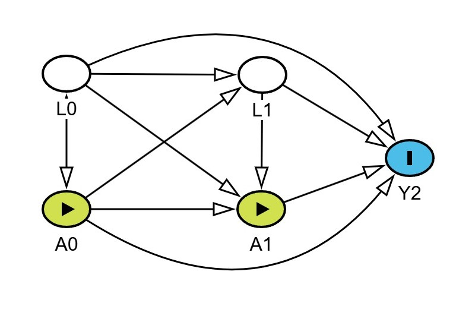

```{r setup, include=FALSE}
knitr::opts_chunk$set(echo = TRUE, message = FALSE, warning = FALSE, results = "hold")
options(width = 70)
library(survival)
library(ltmle)
```

```{css, echo = FALSE}
/* body text */
body { font-size: 15px; line-height: 1.55; }

/* "in a nutshell" boxes: same size as the text, styled as a callout */
blockquote {
  font-size: 15px;
  margin: 1em 0;
  padding: 0.6em 1em;
  border-left: 4px solid #2c7fb8;
  background: #f3f8fc;
  color: #333;
}
blockquote p:last-child { margin-bottom: 0; }

/* headings */
h1.title  { font-size: 30px; }
h4.author, h4.date { font-size: 15px; font-weight: normal; }
h1 { font-size: 26px; margin-top: 1.6em; }
h2 { font-size: 21px; margin-top: 1.4em; }
h3 { font-size: 18px; }
h4 { font-size: 16px; }

/* code and output slightly smaller than text */
pre, pre code { font-size: 13px; }

/* MathJax 3, in case your setup uses it */
mjx-container { font-size: 90% !important; }
```

# Introduction {#intro}

This tutorial provides step-by-step guidance on treatment effect
estimation for time-to-event data using the Targeted Learning framework.
We focus on a setting with **time-varying treatment and
confounders/covariates, without censoring**, and use the `ltmle` R
package [@lendle2017] for computations.

> **How to read this tutorial.** You do not need to follow every
> equation to follow the logic. Each section opens with a short *in a
> nutshell* box. If you read only those boxes and run the code, you will
> have the main ideas. Sections marked *self-paced* can be skipped on
> first reading.

**Tutorial organisation.** We first discuss the Cox proportional hazards
model, its assumptions and limitations (Section \@ref(cox)). We then
present causal risk quantities that can serve as target parameters
(Section \@ref(targets)) and set up the causal problem (Section
\@ref(estimation)). Next we describe the TMLE-based alternative:

- **Part I** (Section \@ref(part1)) — TMLE *by hand*, step by step;
- **Part II** (Section \@ref(part2)) — the same with the `ltmle`
  package;
- **Part III** (Section \@ref(part3)) — flexible nuisance estimation
  with Super Learner (*self-paced*);
- **Part IV** (Section \@ref(part4)) — misspecification and (sequential)
  double robustness;
- **Part V** (Section \@ref(part5)) — converting standard survival data
  into the format `ltmle()` requires.

## A motivating example {#motivation}

There are two major anti-diabetic medicine classes, GLP-1 receptor
agonists (GLP-1RA) and SGLT2 inhibitors (SGLT2i), which have protective
cardiovascular effects. Consider a cohort of adults with type 2 diabetes
and established cardiovascular disease, initiating either an SGLT2i or a
GLP-1RA, followed for 3-point MACE (a composite of cardiovascular death,
non-fatal myocardial infarction, non-fatal stroke). Both classes reduce
cardiovascular risk, but which to start — and whether to persist with it
— is decided in clinic rather than fixed at baseline. Blood sugar level
(HbA1c) is measured at baseline and remeasured every few months, and the
value drives what happens next: a patient at target continues the
current medicine, one who is not may be switched to the other class or
have therapy intensified.

*We want to learn the effect of initiation and sustained use of GLP-1RA
vs initiation and sustained use of SGLT2i on the risk of MACE.*

The complication with standard techniques is as follows. HbA1c is itself
lowered by the drug the patient is on, so it is a **consequence of prior
treatment**; it also **determines subsequent treatment**; and, as a
marker of glycaemic burden and disease severity, it **predicts MACE**.
Adjusting for time-updated HbA1c in a Cox model therefore blocks part of
the very pathway we want to measure, while omitting it leaves later
treatment confounded. No single regression recovers the effect of
sustained treatment with either class.

In the simulated example used throughout, the nodes map onto this story
as follows:

| Node | Clinical meaning |
|----|----|
| $L_0 = (L_{01}, L_{02})$ | baseline characteristics (binary, e.g. prior MI; continuous, e.g. HbA1c) |
| $A_0$ | initiated class: GLP-1RA ($1$) or SGLT2i ($0$) |
| $L_1 = (L_{11}, L_{12})$ | the same characteristics remeasured at the first review |
| $A_1$ | class in use after the review |
| $Y_2$ | MACE by the end of follow-up |

The simulation coefficients are **illustrative only**. They are chosen
to make the methods visible, not to reproduce trial results.

## The current standard — Cox PH {#cox}

> **In a nutshell.** The Cox model summarises treatment effects as a
> hazard ratio. The hazard ratio is convenient, but it is a conditional,
> non-collapsible quantity. It answers a different question from "how
> much would risk change if everyone were treated?".

The Cox proportional hazards model has been the standard for analysing
time-to-event data in randomised controlled trials (RCTs) for decades.
Its popularity stems from the convenient interpretation of hazard ratios
(HR) as relative risk measures. It is a semi-parametric regression model
relating survival time (time to event) to one or more predictors (e.g.
treatment and baseline covariates).

The Cox PH model relies on two assumptions.

- **Proportional hazards.** The treatment effect is constant over time,
  and hazards for different individuals differ only through their
  covariates. The hazard at time $t$ given covariates
  $\mathbf{X}=(X_1,\dots,X_p)$ is the baseline hazard $h_0(t)$
  multiplied by $\exp(\boldsymbol\beta^\top\mathbf{X})$:
  $$h(t\mid \mathbf{X}) = h_0(t)\exp(\beta_1 X_1 + \dots + \beta_p X_p).$$
  Here the **hazard** is the instantaneous *rate* of experiencing the
  event at $t$ among those still event-free:
  $$h(t) = \lim_{\Delta t \to 0}\frac{\mathbb{P}(t \le T < t+\Delta t \mid T \ge t)}{\Delta t}.$$
  The resulting survival probability is
  $S(t\mid \mathbf{X}) = \mathbb{P}(T>t\mid\mathbf{X}) = \exp\{-\int_0^t h(u\mid \mathbf{X})\,du\}$.

- **Non-informative censoring.** Censoring is independent of the event
  time *given the covariates in the model*.

These assumptions are often too restrictive in practice, which leads to
important limitations for both design and analysis.

### The hazard ratio lacks a clear causal interpretation

Unlike direct measures of survival probability, the HR is a conditional
comparison of instantaneous event rates **among patients still alive**
at each time point. This creates two problems.

- **Non-comparability across studies.** Even between methodologically
  perfect trials in identical populations, the estimated HR may differ.
  It is a weighted average of time-specific ratios, and the weights
  depend on each study's censoring and follow-up patterns.

- **Dynamic selection (survivor) bias.** Randomisation ensures baseline
  comparability, but as the study progresses the HR compares
  increasingly dissimilar groups. If a treatment causes early events in
  susceptible patients, the remaining treated cohort becomes enriched
  with resilient individuals, while the control group keeps its original
  risk mix. The HR can then suggest benefit even when the treatment
  harms some subgroups.

The HR answers *"what is the hazard ratio among survivors at time* $t$?"
rather than the more clinically relevant *"what is the average treatment
effect for all patients at time* $t$?".

### The hazard ratio is not collapsible

*A measure is called collapsible if its value remains unchanged when a
non-confounder is removed from the model. Formally, a summary measure*
$g$ of the association between $Y$ and $A$ is collapsible over $W$ if
$$\mathbb{E}_W\{g[\mathbb{P}(Y,A\mid W)]\} = g[\mathbb{P}(Y,A)].$$

*For example, if* $W$ is a stratifying variable with $m$ levels (gender,
age group, etc.), $g$ is collapsible if the effect in the whole sample
equals a weighted average of the stratum-specific effects $g_m$.

**The hazard ratio from the Cox model is not collapsible, and is
therefore not a reliable target parameter.** The HR changes depending on
which covariates are in the model, even when those covariates do not
confound the treatment–outcome relationship. The choice of adjustment
variables therefore does not only affect precision. It changes *what is
being estimated*.

#### Example {#example-collapse}

Suppose we want the effect of $A$ on the outcome. In the Cox model
$$h(t\mid A, W) = h_0(t)\exp(\beta_a A + \beta_w W),$$ the **conditional
HR** for $A$ is $\exp(\beta_a)$. If we omit $W$ and fit
$$h(t\mid A) = h^*_0(t)\exp(\beta_a^* A),$$ the **marginal HR**
$\exp(\beta^*_a)$ differs from $\exp(\beta_a)$ whenever $W$ affects the
hazard ($\beta_w \neq 0$), **even if** $A$ is randomised and therefore
independent of $W$. This is not bias. The two models estimate *different
quantities*, and neither is wrong.

```{r collapsibility, cache=TRUE}
## A is randomised (independent of W); the conditional Cox model is exactly
## correct. Any gap below is pure non-collapsibility, not confounding.

set.seed(2026)
n_c <- 20000
W   <- rbinom(n_c, 1, 0.5)
A   <- rbinom(n_c, 1, 0.5)                      # randomised
Tev <- rexp(n_c, rate = 0.05 * exp(log(2) * A + log(5) * W))  # true cond. HR = 2
dc  <- data.frame(A, W, time = pmin(Tev, 10), status = as.integer(Tev <= 10))

fit_adj   <- coxph(Surv(time, status) ~ A + W, data = dc)
fit_unadj <- coxph(Surv(time, status) ~ A,     data = dc)
round(c(true_conditional_HR = 2,
        adjusted_HR         = unname(exp(coef(fit_adj)["A"])),
        unadjusted_HR       = unname(exp(coef(fit_unadj)["A"]))), 3)

## The RISK RATIO at t = 10 does not depend on adjustment:
## standardised (adjusted) vs crude Kaplan-Meier agree up to sampling error.
pW <- mean(dc$W)
risk_std <- sapply(0:1, function(a) {
  s <- summary(survfit(fit_adj, newdata = data.frame(A = a, W = 0:1)),
               times = 10)$surv
  1 - ((1 - pW) * s[1] + pW * s[2])
})
risk_km <- 1 - summary(survfit(Surv(time, status) ~ A, data = dc),
                       times = 10)$surv
round(c(RR_standardised = risk_std[2] / risk_std[1],
        RR_crude_KM     = risk_km[2]  / risk_km[1]), 3)
```

The adjusted HR recovers 2. The unadjusted HR, fitted to *randomised*
data with nothing to confound, is noticeably closer to 1. The risk
ratios, by contrast, agree whether or not we adjust: they are
collapsible.

## Causal risk quantities — possible target parameters {#targets}

> **In a nutshell.** Instead of a hazard ratio, we target quantities
> defined on the risk scale, such as the probability of an event by time
> $t$ "had everyone followed strategy $d$". These are easy to interpret
> and collapsible.

We denote by $A$ the exposure (treatment), with $A=1$ one treatment and
$A=0$ the other (or treatment vs no treatment). The outcome $T$ is the
time from treatment initiation to the first event. A **treatment
regime** $d$ is a rule fixing treatment at every time point. $T^{d}$
denotes the **counterfactual** time to event that would have been
observed had the subject followed regime $d$. Let $L$ be (possibly
time-varying) covariates/confounders.

Causal quantities of interest include:

- the **counterfactual survival probability** by time $t$ under $d$,
  $S^d(t) = \mathbb{P}(T^d > t)$;
- the **counterfactual risk** at time $t$,
  $\mathbb{P}(T^d \le t) = 1 - S^d(t)$;
- contrasts between regimes $d_1$ and $d_2$:
  - **survival difference**, $S^{d_1}(t) - S^{d_2}(t)$;
  - **survival ratio**, $S^{d_1}(t) / S^{d_2}(t)$;
  - **risk ratio**, $RR_t = \{1 - S^{d_1}(t)\}/\{1 - S^{d_2}(t)\}$.

All of these are collapsible.

In this tutorial we use the **risk ratio**. Note, that the outcome of
interest can be equivalently written as an event indicator
$Y(t) = \mathbb{I}\{T \le t\}$, with counterfactual
$Y^d(t) = \mathbb{I}\{T^d \le t\}$ and counterfactual risk
$\mathbb{E}\{Y^d(t)\} = \mathbb{P}\{Y^d(t) = 1\}$. We use this
formulation from now on.

# Estimating the risk ratio with Targeted Learning {#estimation}

## Causal model

We consider $K$ time points $t = 1, \dots, K$. At each time point:

- the treatment $A_t$, assigned at baseline ($A_0$), is reassessed;
- the event indicator $Y_t = 1$ if the event has occurred at or before
  $t$, and $0$ otherwise. Once $Y_t = 1$, $Y_{t'} = 1$ for all $t' > t$
  (**monotonicity**: once an event has happened, it has happened);
- there is no censoring: everyone is followed until $K$;
- covariates/confounders $L_t$ are measured, can be discrete or
  continuous.

> **Simplification in the running example.** To keep the hand
> calculations short, the example has $K = 2$ and the outcome is
> recorded only at the end of follow-up ($Y_2$). There is no $Y_1$ node,
> so nobody "drops out" by having an event before the second treatment
> decision. Part V and the Appendix show the general structure, with an
> event indicator in every interval.

The figure shows the assumed causal structure for $K = 2$.

```{r dag, echo=FALSE, out.width="30%", fig.align="center", fig.cap="DAG describing the assumed causal structure of the data."}

```

## The target parameter

We target the risk ratio at $t = 2$ between two regimes of **sustained**
use, $d_1 = \{A_0 = 1, A_1 = 1\}$ and $d_2 = \{A_0 = 0, A_1 = 0\}$:
$$\psi = \frac{\mathbb{E}\{Y^{d_1}(2)\}}{\mathbb{E}\{Y^{d_2}(2)\}}.$$

## Identification

> **In a nutshell.** We never observe $Y^{d}(2)$ for everyone: most
> people did not follow $d$. Identification assumptions are what allow
> us to rewrite the counterfactual risk as something computable from the
> observed data.

Besides **consistency** (if a person's observed treatment history
matches $d$, their observed outcome *is* $Y^d$; this needs a
well-defined regime) and **no interference** (one person's treatment
does not affect another's outcome), we require:

- **Sequential exchangeability (randomisation).** At each time point,
  among those still event-free and still following the regime, treatment
  is as good as randomised given the measured past. Intuitively, all
  common causes of the treatment decision and the subsequent outcome are
  measured and recorded before that decision is made.

- **Positivity.** At each time point, among those still event-free and
  still following the regime, every history that occurs must have a
  positive chance of receiving the treatment the regime specifies.
  Intuitively, whatever a patient's history, someone with that history
  could plausibly have received the regime's treatment. Unlike
  exchangeability, positivity is partly **checkable** in the data (see
  `summary(fit$cum.g)` in Part II).

Under these assumptions $\mathbb{E}\{Y^{d}(2)\}$ is identified by a
sequence of **nested conditional expectations**. For
$d = \{A_0 = a_0, A_1 = a_1\}$:
$$\mathbb{E}\{Y^{d}(2)\} = \mathbb{E}_{L_0}\Big[\, \mathbb{E}\big[\, \mathbb{E}[\, Y_2 \mid L_0, A_0 = a_0, L_1, A_1 = a_1 ] \,\big|\, L_0, A_0 = a_0 \big] \Big].$$

### Why nested conditional expectations? {#why-nested}

In the motivating example, we **must** condition on $L_1$ to remove
confounding of the decision $A_1$. But conditioning on $L_1$ in a single
regression blocks the part of $A_0$'s effect that goes through $L_1$. If
an unmeasured factor (e.g. frailty) affects both $L_1$ and the outcome,
conditioning on $L_1$ also opens a collider path between $A_0$ and that
factor. Either way, *one regression cannot do both jobs*.

The nested expectations do the two jobs at **different levels**:

1.  The **inner** expectation $\mathbb{E}[Y_2 \mid L_0, a_0, L_1, a_1]$
    conditions on $L_1$. This removes confounding of $A_1$.
2.  The **middle** expectation $\mathbb{E}[\,\cdot \mid L_0, a_0]$
    *averages* $L_1$ out, over the distribution $L_1$ would have under
    $a_0$. $L_1$ therefore keeps its mediating role instead of being
    blocked.
3.  The **outer** expectation averages over baseline covariates and
    gives the target.

> **Intuition.** $L_1$ is allowed to do its de-confounding work inside
> the formula and then disappears before the final answer. The price is
> that the identification assumptions are needed **once per time
> point**. The benefit is that each step then looks like an ordinary
> point-treatment adjustment given the past.

## Estimation rationale {#rationale}

> **In a nutshell.** We estimate the nested expectations with
> regressions, one per time point, working *backwards* in time. After
> each regression we apply a small correction (the *targeting step*) so
> that the final estimate is well behaved and comes with a valid
> confidence interval.

We cannot compute $\mathbb{E}\{Y^d(2)\}$ directly because the
counterfactual outcomes are missing for everyone who did not follow $d$.
The identification formula says we can instead compute a chain of
ordinary conditional expectations of *observed* data, and conditional
expectations are exactly what regression estimates. Two properties of
conditional expectation make this work:

- the **tower property**,
  $\mathbb{E}[\mathbb{E}(X\mid\mathcal{H})\mid\mathcal{G}] = \mathbb{E}(X\mid\mathcal{G})$
  for $\mathcal{G}\subseteq\mathcal{H}$. Averaging an inner regression
  over the coarser history gives the right answer, so we can peel off
  one time point at a time;
- a conditional expectation is a **function of the conditioning
  variables only**. We can fit a regression on some people and then
  *predict* it for everyone.

LTMLE then repeats three moves, starting at the last time point:

| Move | What we do | Why |
|----|----|----|
| 1\. Regress | Regress the current outcome on the history | estimates the inner conditional expectation |
| 2\. Predict under $d$ | Predict for everyone with treatment set to the regime | "what would happen to people with a given history under $d$" |
| 3\. Target | Fluctuate the predictions with a one-parameter logistic regression | removes leftover bias relevant for $\psi$; gives valid CIs |

The targeted predictions become the **outcome** (a *pseudo-outcome*) for
the regression at the previous time point, and the moves are repeated.
At the end, averaging the baseline-level predictions over everyone gives
the estimate.

**Why backwards?** To know the value of a strategy *from baseline*, we
first need to know its value from every situation a patient might reach
later (similar to evaluating a decision tree from the leaves).

**Why the targeting step?** Regressions are tuned to predict well, not
to estimate $\psi$ well. The targeting step uses the **clever
covariate** (an inverse-probability-of-treatment weight) to correct the
initial fit in the direction that matters for $\psi$. This is what makes
TMLE *doubly robust* (Part IV) and gives it a valid
influence-curve-based variance (Part I, Section \@ref(ic)).

## Running example {#example}

For simplicity, we use $K = 2$ time points with:

- two covariates/confounders, one binary and one continuous, measured at
  baseline, $L_0 = (L_{01}, L_{02})$, and at time $t=1$,
  $L_1 = (L_{11}, L_{12})$;
- binary treatment at baseline, $A_0$, and at $t=1$, $A_1$;
- event indicator $Y_2$ measured at $t=2$.

We generate $n$ observations from the following model: $$\begin{align*}
&\mathbb{P}(L_{01} = 1) = 0.4,\\
&L_{02} \sim \mathcal{N}(7.5, 1),\\
&\mathbb{P}(A_0 = 1\mid L_0) = \text{expit}\{-1 + 0.8 L_{01} + 0.6 (L_{02} - 7.5)\},\\
& \\
&\mathbb{P}(L_{11} = 1 \mid L_0, A_0) = \text{expit}\{-1 - 0.5 A_0 + 0.7 L_{01}\},\\
&L_{12}\mid L_0, A_0 \sim \mathcal{N}(L_{02} - 0.4 A_0, 1),\\
&\mathbb{P}(A_1 = 1\mid L_0, A_0, L_1) = \\
& \quad \text{expit}\{-0.3 + 0.7 L_{11} + 0.5 (L_{12} - 7.5) + 0.4 A_0 + 0.3 L_{01} + 0.2 (L_{02} - 7.5)\},\\
&\\
&\mathbb{P}(Y_2 = 1 \mid L_0, A_0, L_1, A_1) = \\
&\quad \text{expit}\{-2.9 + 0.2 A_0 + 0.4 A_1 + 0.6 L_{11} + 0.5 (L_{12} - 7.5) + \\
& \qquad \qquad \qquad \qquad \qquad \qquad \qquad \quad + 0.3 L_{01} + 0.4 (L_{02} - 7.5)\},
\end{align*}$$ where $\text{expit}(x) = 1/(1+e^{-x})$ is the inverse
logit.

```{r monte-carlo-true-quantities, cache=TRUE}
## Ground truth by direct Monte Carlo: simulate the same structural equations
## with A0 and A1 FORCED to the regime values. With a large sample this
## recovers E[Y2^d] almost exactly. Used ONLY to grade the estimators.
generateData_truth <- function(n, a0, a1) {
  L01 <- rbinom(n, 1, 0.4)
  L02 <- rnorm(n, mean = 7.5, sd = 1)
  A0  <- rep(a0, n)                                    # forced, not drawn
  L11 <- rbinom(n, 1, plogis(-1.0 - 0.5*A0 + 0.7*L01))
  L12 <- rnorm(n, mean = L02 - 0.4*A0, sd = 1)
  A1  <- rep(a1, n)                                    # forced, not drawn
  Y2  <- rbinom(n, 1, plogis(-2.9 + 0.2*A0 + 0.4*A1 + 0.6*L11 +
                             0.5*(L12 - 7.5) + 0.3*L01 + 0.4*(L02 - 7.5)))
  mean(Y2)
}
set.seed(9999)
truth_d1 <- generateData_truth(3e6, 1, 1)   # E[Y2^d1], d1 = (1,1)
truth_d0 <- generateData_truth(3e6, 0, 0)   # E[Y2^d2], d2 = (0,0)

#cat("Monte Carlo truth:  d1=(1,1):", round(truth_d1, 4),
#    "   d2=(0,0):", round(truth_d0, 4),
#    "   RR:", round(truth_d1/truth_d0, 4), "\n\n")
```

The true **risks** of the event by $t = 2$ are
$\mathbb{E}\{Y^{d_1}(2)\} = `r round(truth_d1, 4)`$ under
$d_1 = \{A_0 = 1, A_1 = 1\}$ and
$\mathbb{E}\{Y^{d_2}(2)\} = `r round(truth_d0, 4)`$ under
$d_2 = \{A_0 = 0, A_1 = 0\}$. The true risk ratio is
$RR_2 = `r round(truth_d1/truth_d0, 4)`$: sustained use of the first
treatment would change the risk by about
`r round(100*(truth_d1/truth_d0 - 1))`% compared with sustained use of
the second.

```{r generate-data}
# Data generating function for our simple example with K=2 
generateData0 <- function(n) {
  L01 <- rbinom(n, 1, 0.4)
  L02 <- rnorm(n, mean = 7.5, sd = 1)
  A0  <- rbinom(n, 1, plogis(-1 + 0.8*L01 + 0.6*(L02 - 7.5)))
  L11 <- rbinom(n, 1, plogis(-1.0 - 0.5*A0 + 0.7*L01))
  L12 <- rnorm(n, mean = L02 - 0.4*A0, sd = 1)
  A1  <- rbinom(n, 1, plogis(-0.3 + 0.7*L11 + 0.5*(L12 - 7.5) + 0.4*A0 + 0.3*L01 + 0.2*(L02 - 7.5)))
  Y2  <- rbinom(n, 1, plogis(-2.9 + 0.2*A0 + 0.4*A1 + 0.6*L11 + 0.5*(L12 - 7.5) + 0.3*L01 + 0.4*(L02 - 7.5)))
  
  # COLUMN ORDER = TEMPORAL ORDER. ltmle reads the DAG off this ordering.
  data.frame(L01, L02, A0, L11, L12, A1, Y2)
}

set.seed(1234)
## n is large on purpose: with a small, realistic effect (~0.03 on the
## risk-difference scale), n = 5000 does NOT reliably give a significant
## result -- try it and watch the CIs sometimes cross the null. n = 10000
## detects it consistently. This is itself a useful illustration of how
## sample size interacts with effect size.
n <- 10000
K <- 2
ObsData <- generateData0(n)
head(ObsData)
```

# Part I — TMLE by hand {#part1}

> **In a nutshell.** We compute the counterfactual risk under
> $d_1 = \{A_0 = 1, A_1 = 1\}$ explicitly, one line at a time. Then we
> wrap the same steps in a function and reuse it for
> $d_2 = \{A_0 = 0, A_1 = 0\}$.
>
> **Roadmap:** (1) model treatment → (2) regress the outcome at $t=2$ →
> (3) target it → (4) step back to $t=0$ and repeat → (5) average and
> form the risk ratio → (6) confidence intervals (*self-paced*).

## Step 1 — model the treatment decisions $A_0$ and $A_1$

> **Why?** We need $\mathbb{P}(A_0 = a_0 \mid L_0)$ and
> $\mathbb{P}(A_1 = a_1 \mid L_0, A_0, L_1)$ to build the clever
> covariate: an inverse-probability weight saying how "unusual" it was
> for a person with this history to follow the regime.

```{r treatment}
## treatment mechanisms (g): fitted ONCE, shared by both regimes
gA0.fit <- glm(A0 ~ L01 + L02,                  family = binomial, data = ObsData)
gA1.fit <- glm(A1 ~ L01 + L02 + A0 + L11 + L12, family = binomial, data = ObsData)

gbound <- 0.01                 # ltmle default: lower bound on CUMULATIVE g
Qbound <- c(0.0001, 0.9999)    # ltmle default: keep Q away from 0/1
```

## Step 2 — initial outcome regression at $t = 2$

> **Pooled vs stratified.** We fit the regression on **everyone**, with
> $A_0$ and $A_1$ as covariates, and then predict with the treatments
> *set* to the regime. This is the `ltmle` default (`stratify = FALSE`).
> Fitting only on regime-followers and leaving $A$ out of the formula is
> an equally valid alternative (`stratify = TRUE`). The two give
> slightly different numbers. Whatever you choose, hand code and package
> must use the same convention.

```{r outcome2}
## Q2 = E[Y2 | L0, A0, L1, A1], fitted on everyone (pooled)
Qfit2 <- glm(Y2 ~ L01 + L02 + A0 + L11 + L12 + A1, family = binomial, data = ObsData)

## predict under the regime: BOTH treatments set to the regime values
Q2_d1 <- predict(Qfit2, newdata = transform(ObsData, A0 = 1, A1 = 1), 
                 type = "response")
Q2_d1 <- pmin(pmax(Q2_d1, Qbound[1]), Qbound[2])
```

## Step 3 — target the outcome regression at $t = 2$

The clever covariate for regime $d = \{A_0 = a_0, A_1 = a_1\}$ at the
$t=2$ step is
$$H^{d}_2 = \frac{\mathbb{I}(A_0 = a_0, A_1 = a_1)}{\mathbb{P}(A_0 = a_0 \mid L_0)\,\mathbb{P}(A_1 = a_1 \mid L_0, a_0, L_1)}.$$
It is non-zero only for people who followed the regime at both decision
points. Each such person is up-weighted by how unlikely that was given
their history. (In the general setting with an event indicator at every
interval, the numerator also contains $\mathbb{I}(Y_1 = 0)$: only those
still event-free count. See the Appendix.)

> **Clever covariate as a weight.** We fit an intercept-only logistic
> regression of $Y_2$ with offset $\text{logit}\,\bar Q_2$ and weights
> $H_2$, then shift every prediction by the fitted intercept
> $\hat\epsilon$. This weighted-intercept form is what `ltmle` uses. It
> solves the same estimating equation as putting $H_2$ in the model as a
> covariate. People off the regime have weight 0 and do not influence
> $\hat\epsilon$.

```{r update2}
## g evaluated at the regime values (A0 SET to 1, not the observed A0)
g0_d1 <- predict(gA0.fit, type = "response")                       # P(A0=1|L0)
g1_d1 <- predict(gA1.fit, newdata = transform(ObsData, A0 = 1),
                 type = "response")                                 # P(A1=1|A0=1,L0,L1)

## bound the cumulative probabilities, as ltmle does, to avoid weights' blowing up
cum_g1_d1 <- pmax(g0_d1, gbound)
cum_g2_d1 <- pmax(g0_d1 * g1_d1, gbound)

## clever covariate for the t = 2 step
H2_d1 <- (ObsData$A0 == 1 & ObsData$A1 == 1) / cum_g2_d1

## targeting: one-parameter logistic "tilt" of Q2
## quasibinomial gives identical estimates to binomial without
## the non-integer-weights warning
mod.update2_d1 <- glm(Y2 ~ 1 + offset(qlogis(Q2_d1)), weights = H2_d1,
                      family = quasibinomial, data = ObsData)
Q2_d1.star <- plogis(qlogis(Q2_d1) + coef(mod.update2_d1))
```

## Step 4 — step back to $t = 0$ and repeat

The targeted predictions `Q2_d1.star` now become the **outcome** (a
pseudo-outcome) of a regression on the baseline history. This regression
averages $L_1$ out. The clever covariate for this step is
$$H^{d}_1 = \frac{\mathbb{I}(A_0 = a_0)}{\mathbb{P}(A_0 = a_0 \mid L_0)}.$$
It involves only the baseline decision, because $A_1$ has already been
"handled" at the previous step.

> **Why `quasibinomial`?** The outcome here is a fitted probability
> between 0 and 1, not a 0/1 variable. A logistic-type regression with
> `quasibinomial` is the standard way to regress a probability while
> keeping predictions inside $[0,1]$.

```{r outcome0}
ObsData$Q2_d1.star <- Q2_d1.star

## regress the UPDATED Q2* on (L0, A0), on everyone; predict at A0 = 1
Qfit1_d1 <- glm(Q2_d1.star ~ L01 + L02 + A0, family = quasibinomial, data = ObsData)
Q1_d1 <- predict(Qfit1_d1, newdata = transform(ObsData, A0 = 1), type = "response")
Q1_d1 <- pmin(pmax(Q1_d1, Qbound[1]), Qbound[2])

## clever covariate for the t = 0 step
H1_d1 <- (ObsData$A0 == 1) / cum_g1_d1

## targeting at t = 0
mod.update1_d1 <- glm(Q2_d1.star ~ 1 + offset(qlogis(Q1_d1)), weights = H1_d1,
                      family = quasibinomial, data = ObsData)
Q1_d1.star <- plogis(qlogis(Q1_d1) + coef(mod.update1_d1))
```

## Step 5 — average, then form the risk ratio

The TMLE of the counterfactual risk $\mathbb{E}[Y^{d_1}(2)]$ is the
**average** of the fully updated baseline predictions. No weights are
needed, because `Q1_d1.star` is already a function of $L_0$ only.

```{r tmle-est}
psi_d1 <- mean(Q1_d1.star)     # estimates P(Y2^d1 = 1)
cat("Explicit by-hand estimate, d1 = (1,1):", round(psi_d1, 4))
```

For $d_2 = \{A_0 = 0, A_1 = 0\}$ we run exactly the same steps, wrapped
in `tmle_regime()`.

```{r tmle-regime-function}
## Same steps as above; reuses the fitted g and Q2 models, because only
## WHERE we evaluate them changes with the regime.
tmle_regime <- function(data, a0, a1, gA0.fit, gA1.fit, Qfit2,
                        gbound = 0.01, Qbound = c(1e-4, 1 - 1e-4)) {
  bQ <- function(x) pmin(pmax(x, Qbound[1]), Qbound[2])

  ## g at the regime values
  p0 <- predict(gA0.fit, newdata = data, type = "response")
  p1 <- predict(gA1.fit, newdata = transform(data, A0 = a0), type = "response")
  g0 <- if (a0 == 1) p0 else 1 - p0
  g1 <- if (a1 == 1) p1 else 1 - p1
  H1 <- (data$A0 == a0) / pmax(g0, gbound)
  H2 <- (data$A0 == a0 & data$A1 == a1) / pmax(g0 * g1, gbound)

  ## t = 2: predict under the regime, then target
  Q2 <- bQ(predict(Qfit2, newdata = transform(data, A0 = a0, A1 = a1),
                   type = "response"))
  e2 <- coef(glm(data$Y2 ~ 1 + offset(qlogis(Q2)), weights = H2,
                 family = quasibinomial))
  Q2star <- plogis(qlogis(Q2) + e2)

  ## t = 0: regress the targeted Q2 on the baseline history, then target
  dd <- transform(data, pseudo = Q2star)
  Q1 <- bQ(predict(glm(pseudo ~ L01 + L02 + A0, family = quasibinomial, data = dd),
                   newdata = transform(dd, A0 = a0), type = "response"))
  e1 <- coef(glm(Q2star ~ 1 + offset(qlogis(Q1)), weights = H1,
                 family = quasibinomial))
  Q1star <- plogis(qlogis(Q1) + e1)

  list(psi = mean(Q1star), Q2star = Q2star, Q1star = Q1star, H1 = H1, H2 = H2)
}

psi_d0 <- tmle_regime(ObsData, a0 = 0, a1 = 0, gA0.fit, gA1.fit, Qfit2)
cat("Function-call estimate, d2 = (0,0):", round(psi_d0$psi, 4))

## sanity check: the function reproduces the explicit d1 computation
stopifnot(abs(tmle_regime(ObsData, 1, 1, gA0.fit, gA1.fit, Qfit2)$psi - psi_d1) < 1e-8)
```

```{r rr-point-estimate}
RR <- psi_d1 / psi_d0$psi
cat("TMLE estimate of the risk ratio:", round(RR, 4), "\n",
    "True risk ratio:               ", round(truth_d1 / truth_d0, 4))
```

## Step 6 — confidence intervals via the influence curve (*self-paced*) {#ic}

> **In a nutshell.** Every observation "pulls" the estimate a little.
> The **influence curve** (IC) measures how much. For TMLE the variance
> of the estimator is approximately $\text{Var}(IC)/n$, so a 95% CI is
> $\hat\psi \pm 1.96\sqrt{\text{Var}(IC)/n}$. No bootstrap is needed.

For the counterfactual risk under $d = \{A_0 = a_0, A_1 = a_1\}$ in our
example, the IC has one term per regression step plus a baseline term:
$$IC(\psi^d) = \underbrace{H_2^{d}\big[Y_2 - \bar Q^{d*}_2\big]}_{t=2\text{ residual}} + \underbrace{H_1^{d}\big[\bar Q^{d*}_2 - \bar Q^{d*}_1\big]}_{t=0\text{ residual}} + \underbrace{\bar Q^{d*}_1 - \psi^d}_{\text{baseline variation}},$$
where $\bar Q_2^{d*}$ and $\bar Q_1^{d*}$ are the **targeted**
predictions with treatment set according to $d$. (In the general setting
the middle term uses the pseudo-outcome
$\tilde Y_1 = Y_1 + (1 - Y_1)\bar Q_2^{d*}$; see the Appendix.)

> **A useful check.** The targeting steps are designed so that the IC
> averages to **exactly zero** in the sample. If `mean(IC)` is not
> numerically 0, something is wrong, most often an untargeted $\bar Q$
> in the formula.

For contrasts between regimes, subtract the ICs first, then take the
variance. The two estimates use data on the same individuals, so they
are correlated. Adding their variances gives intervals that are too
wide.

| Contrast                           | Influence curve                      |
|------------------------------------|--------------------------------------|
| Risk difference, $\psi_1 - \psi_0$ | $IC_1 - IC_0$                        |
| Risk ratio, $\psi_1/\psi_0$        | $IC_1/\psi_0 - \psi_1 IC_0/\psi_0^2$ |
| **log** risk ratio                 | $IC_1/\psi_1 - IC_0/\psi_0$          |

`ltmle` builds the RR interval on the **log scale** and exponentiates,
so the interval is asymmetric and always positive.

**Tasks**

a.  Compute the IC for both regimes and check that each has mean ≈ 0.
b.  Compute 95% CIs for the two counterfactual risks.
c.  Compute a 95% CI for the risk difference.
d.  Compute 95% CIs for the risk ratio, on the natural and on the log
    scale. Which one will match `ltmle`?
e.  *Think:* why is $\text{Var}(IC_1) + \text{Var}(IC_0)$ the wrong
    variance for the risk difference?

<details>

<summary>Solution</summary>

```{r IC}
## (a) influence curves -- built from TARGETED fits
IC_d1 <- H2_d1 * (ObsData$Y2 - Q2_d1.star) +
         H1_d1 * (Q2_d1.star - Q1_d1.star) + Q1_d1.star - psi_d1
IC_d0 <- psi_d0$H2 * (ObsData$Y2 - psi_d0$Q2star) +
         psi_d0$H1 * (psi_d0$Q2star - psi_d0$Q1star) + psi_d0$Q1star - psi_d0$psi
c(mean_IC_d1 = mean(IC_d1), mean_IC_d0 = mean(IC_d0))     # both ~ 0

## (b) absolute risks
se_d1 <- sqrt(var(IC_d1) / n); se_d0 <- sqrt(var(IC_d0) / n)
alpha <- 0.05 # defines certainty for confidence intervals, here 1 - 0.95
ci <- function(est, se) round(c(est = est, lo = est - qnorm(1-alpha/2)*se, hi = est + qnorm(1-alpha/2)*se), 4)
rbind(risk_d1 = ci(psi_d1, se_d1), risk_d2 = ci(psi_d0$psi, se_d0))

## (c) risk difference
se_RD <- sqrt(var(IC_d1 - IC_d0) / n)
ci(psi_d1 - psi_d0$psi, se_RD)

## (d) risk ratio
IC_RR    <- IC_d1 / psi_d0$psi - IC_d0 * psi_d1 / psi_d0$psi^2   # natural scale
IC_logRR <- IC_d1 / psi_d1     - IC_d0 / psi_d0$psi              # log scale
se_RR    <- sqrt(var(IC_RR)    / n)
se_logRR <- sqrt(var(IC_logRR) / n)
rbind(natural_scale = round(c(RR, RR - qnorm(1-alpha/2)*se_RR, RR + qnorm(1-alpha/2)*se_RR), 4),
      log_scale     = round(exp(log(RR) + c(0, -qnorm(1-alpha/2), qnorm(1-alpha/2)) * se_logRR), 4))
```

(e) Both estimates are computed on the same people and share the
    baseline term $\bar Q_1^* - \psi$, so their ICs are positively
    correlated. $\text{Var}(IC_1 - IC_0)$ accounts for this covariance.
    Adding the variances ignores it and overstates the uncertainty.

</details>

# Part II — TMLE with the `ltmle` package {#part2}

> **In a nutshell.** Everything in Part I is one function call. The main
> task is to tell `ltmle()` which column plays which role.

`ltmle()` reads the temporal structure from the **order of the
columns**. Baseline covariates come first, then treatment, covariates
and outcome nodes in time order. We name three kinds of nodes:

- `Anodes`: treatment variables, here `A0` and `A1`;
- (`Cnodes`: censoring indicators; none here);
- `Lnodes`: time-varying covariates measured **after** the first
  treatment, here `L11` and `L12`;
- `Ynodes`: the outcomes, here only `Y2`.

Baseline covariates are **not** declared. Everything before the first
`Anode` is treated as baseline, which is why `L01` and `L02` appear in
the data but not in the call. If the columns are shuffled, `ltmle()`
will give a wrong answer without warning.

`abar = list(c(1,1), c(0,0))` asks for the two regimes we computed by
hand. We do not supply `Qform` or `gform`, so `ltmle()` uses main-terms
regressions on all available history. These are the same models we used
in Part I. In a real analysis you would specify them, or use Super
Learner (Part III).

> **Two settings to match the hand calculation.**
> `variance.method = "ic"` uses the plain influence-curve variance from
> Section \@ref(ic). The default, `"tmle"`, is more conservative under
> near-positivity violations. The default, `stratify = FALSE`, fits
> regressions on all individuals rather than only on those who followed
> the regime. `estimate.time = FALSE` skips a timing pre-run.

```{r ltmle}
fit <- ltmle(ObsData[, c("L01","L02","A0","L11","L12","A1","Y2")],
             Anodes = c("A0","A1"),
             Lnodes = c("L11","L12"),
             Ynodes = "Y2",
             abar   = list(c(1,1), c(0,0)),
             variance.method = "ic",
             estimate.time   = FALSE)
s <- summary(fit)

cat("\n",
    "ltmle():             d1 =", round(s$effect.measures$treatment$estimate, 4),
    "  d2 =", round(s$effect.measures$control$estimate, 4), "\n",
    "by-hand computation: d1 =", round(psi_d1, 4),
    "  d2 =", round(psi_d0$psi, 4), "\n",
    "Monte Carlo truth:   d1 =", round(truth_d1, 4),
    "  d2 =", round(truth_d0, 4))
```

**Reading the output.** `summary(fit)` reports, for each regime, the
estimated risk (`treatment`, `control`) and the contrasts: risk
difference (`ATE`), risk ratio (`RR`) and odds ratio (`OR`). Each comes
with a standard error, p-value and 95% CI.

```{r ltmle-summary}
s
```

Compare the risk-ratio interval with your hand computation from Section
\@ref(ic):

```{r ltmle-vs-hand-ci}
## will fail if the section on Influence function computation and CIs was not run
## CI comparison
ci_tab <- rbind(ltmle_RR_CI = round(as.vector(s$effect.measures$RR$CI), 4),
      hand_log_scale = round(exp(log(RR) + c(-qnorm(1-alpha/2), qnorm(1-alpha/2)) * se_logRR), 4))
colnames(ci_tab) <- c("lower", "upper")
ci_tab
```

When you **do** supply `Qform` and `gform`, check which models `ltmle()`
actually fitted. If it does not recognise a node name, it silently falls
back to its default.

```{r ltmle-formulas}
print(fit$formulas)
summary(fit$cum.g)    # positivity check: values near 0 are a warning sign
```

# Part III — `ltmle` with Super Learner (*self-paced*) {#part3}

> **In a nutshell.** In real data we do not know the right regression
> models. Super Learner fits several candidate models and combines them,
> using cross-validation to decide how much each contributes. TMLE then
> targets the combined fit.

So far the regressions happened to have the right form. In practice the
true models are unknown, and flexible learners reduce the risk of
misspecification bias.

`SL.library` can be:

- a character vector of learners used for both $Q$ and $g$; or
- a list with components `Q` and `g`, one character vector each.

`"glm"` means "call `glm` instead of Super Learner". `"default"` uses
`ltmle`'s default library, which consists of main-terms models
(`SL.glm`, `SL.stepAIC`, `SL.bayesglm`, and screened variants). It is
often worth adding learners that capture non-linearities and
interactions.

Further reading: [the `sl3` chapter of the tlverse
handbook](https://tlverse.org/tlverse-handbook/sl3.html) and [this
applied
tutorial](https://ehsanx.github.io/EpiMethods/machinelearningCausal2.html).

```{r ltmle-SL, cache=TRUE}
library(SuperLearner)
fit.SL <- ltmle(ObsData[, c("L01","L02","A0","L11","L12","A1","Y2")],
                Anodes = c("A0","A1"),
                Lnodes = c("L11","L12"),
                Ynodes = "Y2",
                abar   = list(c(1,1), c(0,0)),
                SL.library = list(Q = c("SL.glm", "SL.glm.interaction", "SL.mean"),
                                  g = c("SL.glm", "SL.mean")),
                variance.method = "ic", estimate.time = FALSE)
summary(fit.SL)
## to check learner weights, run: fit.SL$fit$Q (outcome) and fit.SL$fit$g (treatment)
```

**Tasks**

a.  Inspect `fit.SL$fit$Q` and `fit.SL$fit$g`. Which learners get the
    most weight? Is that what you expect given the data-generating
    model?
b.  Add a non-linear learner (e.g. `"SL.earth"` or `"SL.ranger"`, this
    will require installing the corresponding packages). Does the
    estimate change? Does the runtime? (Reduce `n` if it is slow.)
c.  **Double robustness with Super Learner.** Give $Q$ a deliberately
    useless library (`"SL.mean"` only) but keep $g$ good. Then do the
    reverse. Compare both with the truth.

<details>

<summary>Solution to (c)</summary>

```{r ltmle-SL-dr, cache=TRUE}
run <- function(Qlib, glib)
  summary(ltmle(ObsData[, c("L01","L02","A0","L11","L12","A1","Y2")],
                Anodes = c("A0","A1"), Lnodes = c("L11","L12"), Ynodes = "Y2",
                abar = list(c(1,1), c(0,0)),
                SL.library = list(Q = Qlib, g = glib),
                variance.method = "ic", estimate.time = FALSE)
         )$effect.measures$RR$estimate

round(c(Q_bad_g_good = run("SL.mean", c("SL.glm", "SL.mean")),
        Q_good_g_bad = run(c("SL.glm", "SL.mean"), "SL.mean"),
        truth        = truth_d1 / truth_d0), 3)
```

Both estimates should be close to the truth: one correct component is
enough. With both libraries reduced to `"SL.mean"`, the estimate
collapses to the confounded crude comparison.

</details>

# Part IV — Misspecification and double robustness {#part4}

> **In a nutshell.** TMLE is consistent if, at each step, *either* the
> outcome regression *or* the treatment models up to that step are
> correct. We test this by deliberately breaking models one at a time.

In the longitudinal setting TMLE is also doubly robust, but in a
**sequential** sense. It is not simply "all $Q$'s right **or** all $g$'s
right". The influence curve is a sum of one term per time point, and
each term is separately doubly robust. For each step we need that step's
$Q$ to be correctly specified, **or** the cumulative treatment model
**up to and including** that step to be correct.

```{r DR, cache=TRUE}
## The IC is a SUM of one term per step:
##  - D2 (the Y2 step) uses H2 = I(A0=a0, A1=a1) / (g0*g1)
##      -> if Q2 is wrong, we need BOTH g0 and g1 right
##  - D1 (the baseline step) uses H1 = I(A0=a0) / g0
##      -> if Q1 is wrong, we need only g0 right; g1 is irrelevant

set.seed(42)
Dbig <- generateData0(50000)

Qform_correct   <- "Q.kplus1 ~ L01 + L02 + A0 + L11 + L12 + A1"
Qform_Y_wrong   <- "Q.kplus1 ~ A0 + A1"      # misspecify Q2 (Y2 step) only
Qform_L11_wrong <- "Q.kplus1 ~ 1"            # misspecify Q1 (baseline step) only
g0_correct <- "A0 ~ L01 + L02"
g1_correct <- "A1 ~ L01 + L02 + A0 + L11 + L12"
g0_wrong <- "A0 ~ 1"; g1_wrong <- "A1 ~ 1"

fit_seqdr <- function(Qform_L11, Qform_Y, gform_A0, gform_A1) {
  Qform <- c(L11 = Qform_L11, Y2 = Qform_Y)   # verify names via fit$formulas
  gform <- c(A0 = gform_A0, A1 = gform_A1)
  f <- suppressWarnings(
    ltmle(Dbig, Anodes = c("A0","A1"),
          Lnodes = c("L11","L12"),
          Ynodes = "Y2", abar = list(c(1,1), c(0,0)),
          Qform = Qform, gform = gform, estimate.time = FALSE))
  s <- summary(f)
  c(d1 = s$effect.measures$treatment$estimate,
    d2 = s$effect.measures$control$estimate)
}

cat("\n Q2 (Y2 step) wrong: does the D2 term need BOTH g0 and g1? \n")
res_q2 <- rbind(
  "g0 correct, g1 correct" = fit_seqdr("Q.kplus1 ~ L01 + L02 + A0", Qform_Y_wrong, g0_correct, g1_correct),
  "g0 correct, g1 WRONG"   = fit_seqdr("Q.kplus1 ~ L01 + L02 + A0", Qform_Y_wrong, g0_correct, g1_wrong),
  "g0 WRONG,   g1 correct" = fit_seqdr("Q.kplus1 ~ L01 + L02 + A0", Qform_Y_wrong, g0_wrong,   g1_correct))
print(round(res_q2, 4))

cat("\n Q1 (baseline step) wrong instead: does the D1 term care about g1? \n")
res_q1 <- rbind(
  "g0 correct, g1 correct" = fit_seqdr(Qform_L11_wrong, Qform_correct, g0_correct, g1_correct),
  "g0 correct, g1 WRONG"   = fit_seqdr(Qform_L11_wrong, Qform_correct, g0_correct, g1_wrong),
  "g0 WRONG,   g1 correct" = fit_seqdr(Qform_L11_wrong, Qform_correct, g0_wrong,   g1_correct))
print(round(res_q1, 4))
cat("\n (truth: d1 =", round(truth_d1, 4), "  d2 =", round(truth_d0, 4), ")\n")
```

When $Q_2$ is wrong, both $g_0$ and $g_1$ must be right: either one
being wrong introduces bias. When $Q_1$ is wrong instead, only $g_0$
matters, and a wrong $g_1$ barely moves the estimate. A misspecified
treatment model *later* in time ($g_1$) therefore threatens only the
steps at or after that time point. It cannot rescue or ruin an earlier
step.

# Part V — Formatting survival data for `ltmle` {#part5}

> **In a nutshell.** Survival data usually arrive as
> `Surv(time, status)` (one row per person) or
> `Surv(start, stop, event)` (several rows per person). `ltmle()` needs
> **one row per person**, columns in **time order**, and a **monotone**
> event indicator per interval. The function below performs the
> conversion and makes each choice explicit.

The target layout, for $K$ intervals, is

```         
baseline | L_0 | A_0 | [C_1] Y_1 | L_1 | A_1 | [C_2] Y_2 | ... | [C_K] Y_K
```

Four rules follow from how `ltmle()` works:

1.  **Time order.** `ltmle()` reads the causal ordering from the column
    order.
2.  **Monotone outcome.** Once $Y_k = 1$, all later $Y$ are $1$
    (required by `survivalOutcome = TRUE`).
3.  **Censoring before outcome.** $C_k$ comes before $Y_k$. Someone
    censored in interval $k$ has $Y_k$ missing. Censoring nodes are
    factors (`"censored"`/`"uncensored"`).
4.  **Nothing after the end.** After an event or censoring, later $L$
    and $A$ are `NA`.

**If treatment is fixed at baseline**, there is only **one** treatment
node, `A_0`. Repeating it as `A_1, A_2, …` would make `ltmle()` model
"treatment changes" that cannot happen, and `abar` would become a vector
of identical values. The `treatment` argument controls this. Under
`"auto"`, the function checks whether treatment ever changes during
follow-up.

Some choices have **no default**, and you must make them for your data:
the time origin, the interval width (each interval adds a $Q$ and a $g$
model, so count events per interval), which value of a covariate counts
as "in force" at each decision point (here: last observation carried
forward), and the horizon.

```{r ltmle-data-prep}
###############################################################################
#  long_to_ltmle()  --  survival data -> ltmle wide format
#
#  Accepts EITHER
#    Shape A: one row per subject, Surv(time, status)
#    Shape B: counting process,    Surv(start, stop, event)   [tmerge output]
#
#  CONVENTIONS (choices, not laws -- change them if your setting differs):
#   * interval k spans (b_{k-1}, b_k], with breaks = (b_0, ..., b_K)
#   * L_k, A_k are the values IN FORCE AT decision point b_k
#     (LOCF: the last measurement at or before b_k; never a future one)
#   * C_k precedes Y_k: censoring in interval k means Y_k is never observed
#   * Y is cumulative -- once 1, always 1 (survivalOutcome = TRUE)
#   * after an event or censoring, later L, A and C are NA
#   * treatment = "baseline": a single A node (A_0)
###############################################################################

long_to_ltmle <- function(data,
                          id,
                          time = NULL, status = NULL,              # Shape A
                          start = NULL, stop = NULL, event = NULL, # Shape B
                          Avar,
                          Lvars    = character(0),
                          baseline = character(0),
                          breaks,
                          treatment = c("auto", "baseline", "time-varying"), 
                          include_C = TRUE,
                          boundary_right_closed = TRUE) {

  treatment <- match.arg(treatment)

  ## ---- normalise input to Shape B ---------------------------------------
  d <- as.data.frame(data)
  if (!is.null(time)) {
    if (is.null(status)) stop("`status` required when `time` is given")
    d$.start <- 0
    d$.stop  <- d[[time]]
    d$.event <- as.integer(d[[status]])
    start <- ".start"; stop <- ".stop"; event <- ".event"
  } else {
    if (is.null(start) || is.null(stop) || is.null(event))
      stop("give either (time, status) or (start, stop, event)")
    d$.event <- as.integer(d[[event]]); event <- ".event"
  }

  stopifnot(is.numeric(breaks), !is.unsorted(breaks), length(breaks) >= 2L)
  K     <- length(breaks) - 1L
  b_end <- breaks[K + 1L]
  bnd   <- breaks[seq_len(K)]        # decision points b_0 ... b_{K-1}

  ## ---- coerce covariates to numeric -------------------------------------
  for (v in c(Avar, Lvars, baseline)) {
    if (is.factor(d[[v]])) {
      if (nlevels(d[[v]]) > 2L)
        stop("`", v, "` has >2 levels: expand to indicators before calling")
      d[[v]] <- as.integer(d[[v]]) - 1L
    }
    if (is.logical(d[[v]])) d[[v]] <- as.integer(d[[v]])
  }

  ## ---- split by subject --------------------------------------------------
  d  <- d[order(d[[id]], d[[start]]), ]
  sp <- split(seq_len(nrow(d)), d[[id]])
  N  <- length(sp)

  ## ---- is treatment time-varying within the window? ----------
  if (treatment == "auto") {
    varies <- vapply(sp, function(i) {
      i <- i[d[[start]][i] < b_end]
      length(unique(d[[Avar]][i])) > 1L
    }, logical(1))
    treatment <- if (any(varies)) "time-varying" else "baseline"
    message("long_to_ltmle(): treatment detected as '", treatment, "'")
  }
  tv_A <- treatment == "time-varying"

  ## ---- exit time and reason ----------------------------------------------
  tend <- vapply(sp, function(i) max(d[[stop]][i]), numeric(1))
  died <- vapply(sp, function(i) as.integer(any(d[[event]][i] == 1L)), integer(1))

  kobs <- findInterval(tend, breaks, left.open = boundary_right_closed)

  ## with right-closed intervals, an event exactly at b_K is IN the window;
  ## censoring exactly at b_K means follow-up was completed event-free.
  past <- if (boundary_right_closed) {
    tend > b_end | (tend == b_end & died == 0L)
  } else {
    tend >= b_end
  }
  kobs[past] <- K + 1L
  died[past] <- 0L                 # events beyond the horizon are not events
  kobs <- pmin(pmax(kobs, 1L), K + 1L)

  ## ---- value in force at each decision point (LOCF) ----------------------
  vnames <- c(Avar, Lvars)
  vals <- lapply(sp, function(i) {
    s <- d[[start]][i]; e <- d[[stop]][i]
    j <- findInterval(bnd, s)                      # last row with start <= b
    j[j < 1L | bnd >= max(e)] <- NA_integer_       # before entry / after exit
    lapply(setNames(nm = vnames), function(cc) as.numeric(d[[cc]][i[j]]))
  })
  pick <- function(v, k) vapply(vals, function(z) z[[v]][k], numeric(1))

  ## ---- assemble, strictly in temporal order ------------------------------
  out <- data.frame(.row = seq_len(N))
  for (bb in baseline)
    out[[bb]] <- vapply(sp, function(i) as.numeric(d[[bb]][i[1L]]), numeric(1))
  for (LL in Lvars) out[[paste0(LL, "_0")]] <- pick(LL, 1L)
  out[["A_0"]] <- pick(Avar, 1L)

  for (k in seq_len(K)) {
    cens_now   <- died == 0L & kobs == k
    cens_prior <- died == 0L & kobs <  k

    if (include_C) {
      Ck <- ifelse(cens_prior, NA_integer_, as.integer(cens_now))
      out[[paste0("C_", k)]] <- ltmle::BinaryToCensoring(is.censored = Ck)
    }
    out[[paste0("Y_", k)]] <- ifelse(cens_prior | cens_now, NA_integer_,
                                     as.integer(died == 1L & kobs <= k))

    if (k < K) {
      atrisk <- kobs > k          # event-free and uncensored through interval k
      for (LL in Lvars)
        out[[paste0(LL, "_", k)]] <- ifelse(atrisk, pick(LL, k + 1L), NA_real_)
      if (tv_A)                                                 
        out[[paste0("A_", k)]] <- ifelse(atrisk, pick(Avar, k + 1L), NA_real_)
    }
  }
  out$.row <- NULL
  rownames(out) <- NULL

  attr(out, "id")        <- names(sp)
  attr(out, "breaks")    <- breaks
  attr(out, "treatment") <- treatment
  attr(out, "nodes")     <- list(
    Anodes = if (tv_A) paste0("A_", 0:(K - 1L)) else "A_0",    
    Cnodes = if (include_C) paste0("C_", 1:K) else NULL,
    ## temporal order (all L's at time 1, then time 2, ...)
    Lnodes = if (length(Lvars) && K > 1L)
               as.vector(outer(Lvars, 1:(K - 1L), paste, sep = "_")) else NULL,
    Ynodes = paste0("Y_", 1:K))
  out
}
```

**Example: the `diabetic` data from `Survival` package.** The 197
patients in this dataset were a $50\%$ random sample of the patients
with "high-risk" diabetic retinopathy as defined by the Diabetic
Retinopathy Study (DRS). Each patient had one eye randomized to laser
treatment and the other eye received no treatment. For each eye, the
event of interest was the time from initiation of treatment to the time
when visual acuity dropped below $5/200$ two visits in a row. Treatment
is fixed at baseline, so the converter creates a single `A_0`. Each
patient has two records corresponding to two eyes. The unit of analysis
is therefore the eye, and the patient is a cluster.

```{r transform-example}
data(diabetic, package = "survival")

## `id` identifies PATIENTS; build a per-eye unit id
diabetic$unit <- paste(diabetic$id, diabetic$eye, sep = "_")

diabetic_ltmle <- long_to_ltmle(diabetic,
                                id = "unit",
                                time = "time", status = "status",
                                Avar = "trt",
                                baseline = c("laser", "age", "eye", "risk"),
                                breaks = c(0, 10, 30))
head(diabetic_ltmle, 10)
attr(diabetic_ltmle, "nodes")
```

# Additional comments {#comments}

- The hazard ratio can be given a causal interpretation through marginal
  structural models for counterfactual hazards, but it is then a
  different quantity from the Cox PH coefficient [@talbot2025].
- Although the HR and the risk ratio are different estimands, with rare
  events and proportional hazards they can be numerically close, as
  shown in real data analyses [@chen2023].
- Inverse probability of treatment and censoring weighting is often used
  to address informative censoring in the Cox model. This requires
  correctly specified exposure **and** censoring models, and the
  resulting estimator is not doubly robust. Non-collapsibility is one
  reason for the lack of double robustness in Cox models: misspecifying
  the outcome model changes the causal quantity being estimated
  [@gabriel2024].
- For survival probabilities and their derivatives (risks, risk and
  survival differences and ratios), TMLE is **doubly robust**: it is
  consistent if **either** the treatment-and-censoring models **or** the
  outcome models are correctly specified, in the sequential sense of
  Part IV.
- The default in `ltmle` is to fit parametric models, but Super Learner
  can be used for the treatment, outcome and censoring models, at the
  cost of computation time (Part III; see [@lendle2017]).
- **Competing risks** (e.g. non-cardiovascular death preventing MACE)
  require cause-specific estimands. The
  [`concrete`](https://github.com/imbroglio-dc/concrete) R package
  implements TMLE for absolute risks with competing events in continuous
  time.
- For complex longitudinal data, such as electronic health records with
  irregular measurement times, the
  [`LtAtStructuR`](https://github.com/romainkp/LtAtStructuR) package
  automates the construction of the analytic data set.

### Use of AI disclosure {.unnumbered}

These materials were drafted with the help of generative AI and verified
and corrected by the author.

### Licence {.unnumbered}

© 2026 Alina Kumukova. This tutorial and its code are licensed under [CC
BY 4.0](https://creativecommons.org/licenses/by/4.0/). You may share and
adapt the material for any purpose, provided you give appropriate
credit.

# Appendix — Estimating ${\small \mathbb{E}[Y^d(t)]}$ at a fixed $\small t$, with censoring {#appendix}

Let $L_j$, $A_j$, $C_j$ and $Y_j$ denote the covariates, treatment,
censoring indicator and event indicator in interval $j$, ordered in this
way within each interval, with $C_0 = Y_0 = 0$ by convention. (The
appendix indexes the first interval as $j = 1$. The main text calls the
baseline time $0$.) Write $\bar L_j = (L_1, \dots, L_j)$ and
$\bar A_j = (A_1, \dots, A_j)$. A regime $d = (d_1, \dots, d_t)$ assigns
treatment $d_j(\bar L_j, \bar A_{j-1})$ at each time point (a static
regime is the special case $d_j = a_j$). "Under regime $d$" means
setting $A_k = d_k$ for all $k \le j$.

Given a random sample of $n$ individuals, the TMLE of $S^d(t)$ follows
these steps.

1.  At each $j = 1, \dots, t$, fit a model for treatment $A_j$ given
    $\bar L_j$ and $\bar A_{j-1}$, among individuals uncensored
    (${\small C_{j-1} = 0}$) and event-free (${\small Y_{j-1} = 0}$) at
    $j-1$. For $j = 1$ this is a model for $A_1$ given the baseline
    covariates $L_1$ among all individuals.

2.  At each $j = 1, \dots, t$, fit a model for censoring $C_j$ given
    $\bar A_j$ and $\bar L_j$, among individuals uncensored and
    event-free at $j-1$. Combine these into the cumulative probability
    of following the regime and remaining uncensored up to time $j$,
    $$\hat g^d_j = \prod_{k=1}^{j}\hat P(A_k = d_k\mid \bar L_k, \bar A_{k-1})\,
    \hat P(C_k = 0\mid \bar L_k, \bar A_k = \bar d_k),$$ and the clever
    covariate
    $$H_j = \frac{I(\bar A_j = \bar d_j,\; C_j = 0)}{\hat g^d_j}.$$

3.  Then proceed recursively, starting from $j = t$:

    - Fit a model ${\small \hat{Q}^d(j, \bar L_j)}$ for $Y_j$ given
      $\bar A_j$ and $\bar L_j$, among individuals uncensored at $j$
      (${\small C_j = 0}$) and event-free before it
      (${\small Y_{j-1} = 0}$).
    - Predict under $d$ (set $\bar A_j$ to $\bar d_j$) for all
      individuals uncensored at $j-1$. For those who had the event by
      $j-1$, set the prediction to $1$.
    - **Targeting:** fit an intercept-only logistic regression of the
      outcome with offset
      ${\small \mathrm{logit}\,\hat Q^d(j, \bar L_j)}$ and weights
      ${\small H_j}$, among individuals uncensored at $j$ and event-free
      at $j-1$. Set
      ${\small \hat{Q}^{d*}(j, \bar L_j) = \mathrm{expit}\{\mathrm{logit}\,\hat{Q}^d(j, \bar L_j) + \hat\epsilon_j\}}$.
    - Compute the component of the influence curve involving the clever
      covariate,
      ${\small D_j = H_j\{\tilde{Q}_j - \hat{Q}^{d*}(j, \bar L_j)\}}$,
      where ${\small \tilde{Q}_j}$ is the outcome used at this step.

    Repeat for ${j = t-1, \dots, 1}$, replacing the observed ${Y_j}$ by
    the updated estimate from the previous step,
    ${\small \hat{Q}^{d*}(j+1, \bar L_{j+1})}$ (set to $1$ for those
    with the event at $j$). This is the pseudo-outcome
    ${\small \tilde Y_j = Y_j + (1 - Y_j)\hat Q^{d*}(j+1, \bar L_{j+1})}$.

4.  The TMLE of the survival probability is
    ${\small \hat{S}^d(t) = 1 - n^{-1}\sum_{i=1}^n \hat{Q}^{d*}(1, L_{1,i})}$,
    with influence curve
    ${\small -\{\sum_{j=1}^{t} D_j + \hat{Q}^{d*}(1, L_1) - (1 - \hat{S}^d(t))\}}$.

# References {.unnumbered}
